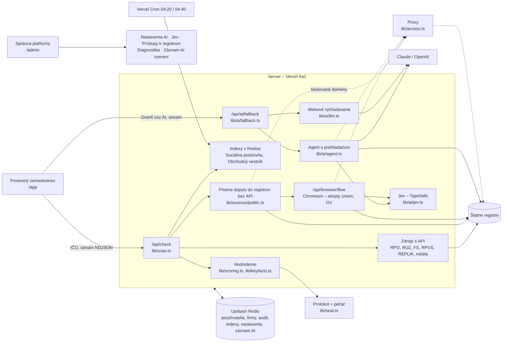
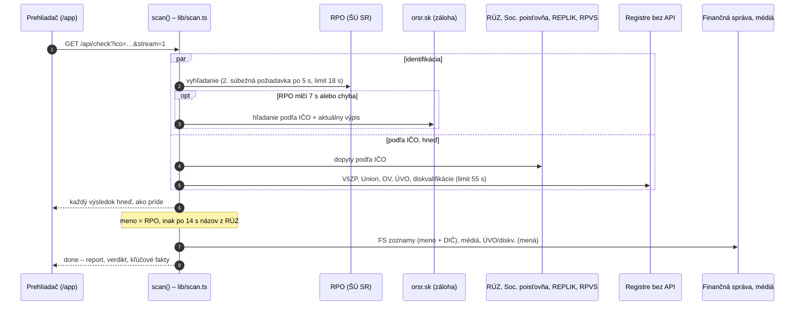
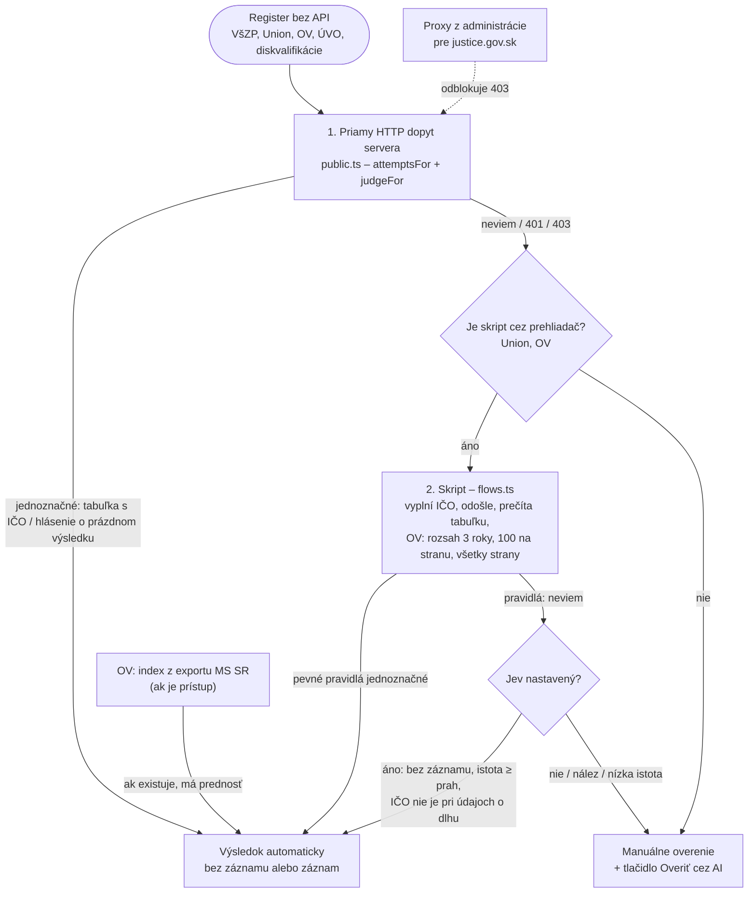
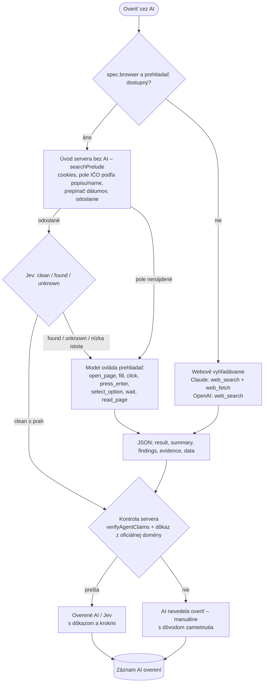
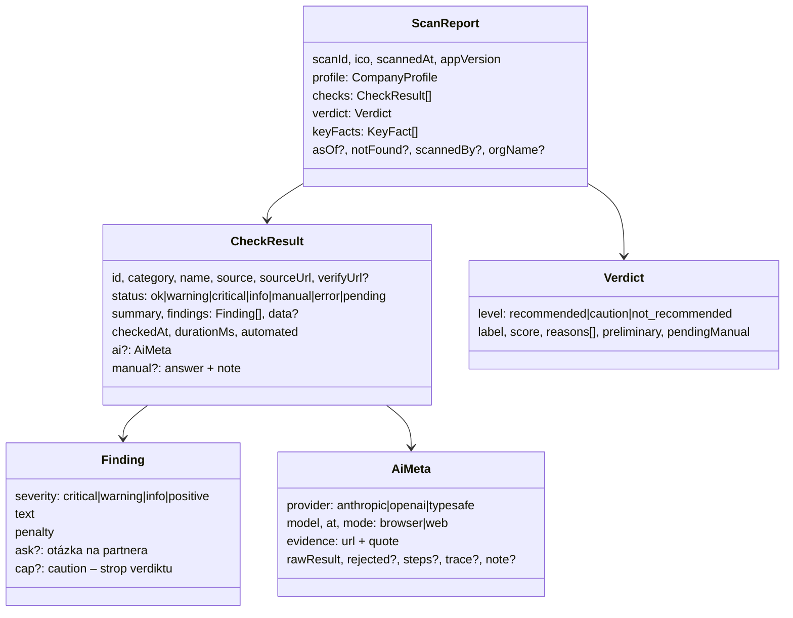
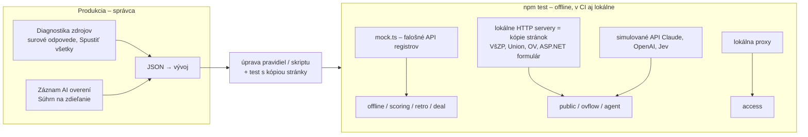
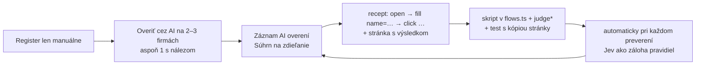

# Architektúra Obozretne – odkiaľ berieme dáta, ako ich overujeme a kto čo rozhoduje

> Živý dokument pre ďalší vývoj. **Aktualizuje sa pri každej zmene zdroja, AI, Jev, prehliadača alebo konfigurácie**
> (pravidlá na konci). `npm test` (súbor `test/docs.test.ts`) kontroluje, že tu je každý zdroj, každé zadanie AI a každá
> premenná prostredia, ktorú kód používa. Diagramy sú v Mermaid – GitHub ich vykreslí priamo.
>
> Stav k verzii **2.9.10** (október 2026). Podrobnosti k jednotlivým registrom: [ZDROJE.md](ZDROJE.md), história zmien: [STAV.md](STAV.md),
> nasadenie: [DEPLOYMENT.md](DEPLOYMENT.md).

## Obsah

1. [Celkový pohľad](#1-celkový-pohľad)
2. [Priebeh jedného preverenia](#2-priebeh-jedného-preverenia)
3. [Registre bez API – rozhodovací strom](#3-registre-bez-api--rozhodovací-strom)
4. [Overenie cez AI – agent s prehliadačom](#4-overenie-cez-ai--agent-s-prehliadačom)
5. [Kto čo rozhoduje – pravidlá, Jev, Claude/OpenAI, človek](#5-kto-čo-rozhoduje)
6. [Zdroje a očakávané polia](#6-zdroje-a-očakávané-polia)
7. [Dátové štruktúry](#7-dátové-štruktúry)
8. [Testovanie a diagnostika](#8-testovanie-a-diagnostika)
9. [Od AI overenia k automatizácii](#9-od-ai-overenia-k-automatizácii)
10. [Konfigurácia](#10-konfigurácia)
11. [Ako tento dokument udržiavať](#11-ako-tento-dokument-udržiavať)

---

## 1. Celkový pohľad



| Vrstva | Súbory | Úloha |
|---|---|---|
| Rozhranie | `app/app/page.tsx`, `app/admin/page.tsx` | preverenie, manuálne overenie, AI s živým priebehom, administrácia |
| Orchestrácia | `lib/scan.ts`, `app/api/check/route.ts` | spustí všetky zdroje súčasne, limity, priebežné výsledky (NDJSON) |
| Zdroje | `lib/sources/*.ts` | jeden súbor na register; vracia `CheckResult` |
| Prehliadač | `lib/browser/session.ts`, `lib/browser/flows.ts`, `app/api/browser/flow` | Chromium na serveri (len v 3 funkciách), skripty bez AI |
| AI | `lib/ai/*.ts` | nastavenia, zadania (`specs.ts`), agent, webové vyhľadávanie, Jev |
| Prístupy | `lib/access.ts` | proxy pre blokované registre, prístup k exportu OV |
| Hodnotenie | `lib/scoring.ts`, `lib/keyfacts.ts`, `lib/deal.ts` | skóre, verdikt, kľúčové fakty, indikátory obchodu |
| Záznamy | `lib/audit.ts`, `lib/ailog.ts` | audit firmy, záznam AI overení a skriptov |

---

## 2. Priebeh jedného preverenia

Všetky zdroje štartujú hneď. Na meno firmy čakajú len zdroje, ktoré ho potrebujú – a najviac 14 s.



Číslo preverenia (`scanIdFor`) posiela server hneď v udalosti `start`, počas behu každých 10 s `ping`; ak spojenie skončí bez `done`,
rozhranie označí nedokončené zdroje ako nedostupné a report ako `incomplete`. Pečať prijme len platné číslo `SK-<IČO>-<14 číslic>`.

Limity: zdroj s API 25 s (potom „Zdroj neodpovedal“), registre bez API 55 s, funkcia 120 s.
Výsledky sa **neukladajú do pamäte** – každé preverenie číta registre nanovo (`CHECK_CACHE_MIN` len ako vedomá výnimka).

---

## 3. Registre bez API – rozhodovací strom



Pravidlo bezpečnosti: **„bez záznamu“ len vtedy, keď server videl odoslané hľadanie a výslovné prázdne výsledky.** Neúplné
čítanie (stránkovanie, chyba) bez nálezu = „neviem“.

---

## 4. Overenie cez AI – agent s prehliadačom



- Model je **predvolene štandardný** (Claude Sonnet 5 / GPT‑5.5); rýchly (Haiku 4.5 / GPT‑6 Luna) je voľba v administrácii
  s automatickým zopakovaním na štandardnom pri chybe modelu.
- Model nikdy nerozhoduje sám: „bez záznamu“ vyžaduje odoslaný formulár a IČO na stránke s výsledkom nesmie byť pri údajoch o dlhu;
  „nájdený“ vyžaduje IČO alebo názov na stránke, ktorú server naozaj videl.
- Priebeh sa streamuje (`/api/ai/fallback?stream=1`): akcie s názvom poľa, popis stránky, vety modelu, verdikt kontroly.

---

## 5. Kto čo rozhoduje

| Krok | Pevné pravidlá servera | Jev (TypeSafe) | Claude / OpenAI | Človek |
|---|---|---|---|---|
| Zdroje s API (RPO, RÚZ, FS, RPVS, REPLIK, Soc. poisťovňa) | **rozhoduje** | – | len záloha na tlačidlo pri výpadku | pri chybe |
| VšZP, ÚVO (priamy dopyt) | **rozhoduje** | – | tlačidlo, ak pravidlá nevedia | áno |
| Union, Obchodný vestník (skript v prehliadači) | **rozhoduje** | „bez záznamu“, keď pravidlá nevedia | tlačidlo | áno |
| Register diskvalifikácií | rozhoduje (s proxy) | v AI overení | agent (s proxy) | áno |
| Vyhodnotenie stránky po úvode servera (AI tlačidlo) | kontroluje tvrdenie | **„bez záznamu“** s istotou ≥ prah | nález, nejasné stránky, navigácia | – |
| Navigácia neznámym formulárom | úvod (IČO, dátumy, odoslanie) | – | **agent** | – |
| Médiá – relevancia článkov | filtre mien, aliasov, štatutárov | – | – | posúdenie |
| CRE, Dôvera | – | – | – | **len manuálne** |
| Indikátory obchodu (SKDP 03/2024) | IBAN v zozname FS | – | – | **vyplní zamestnanec** |
| Odporúčané otázky na partnera (`Finding.ask`, napr. chýbajúca závierka) | navrhne otázku | – | – | **zapíše dôvod** do protokolu (skóre nemení) |
| Verdikt a skóre | **lib/scoring.ts** | – | – | manuálne výsledky menia skóre |

Skóre = 100 − kritické − min(upozornenia, 40) + min(pozitíva, 10); akýkoľvek kritický nález ⇒ NEODPORÚČAME;
≥ 85 ODPORÚČAME, ≥ 60 S VÝHRADOU. Zistenie so stropom (`Finding.cap = "caution"`, napr. chýbajúca účtovná závierka) ⇒ najviac
S VÝHRADOU a skóre najviac 84 – pozitíva ho nevyvážia. Rovnako pri nedostupnej identifikácii (RPO) alebo 3+ nedostupných
zdrojoch – nič neoverené nesmie vyzerať ako „bezpečný partner“.

---

## 6. Zdroje a očakávané polia

### Automatické zdroje (API, indexy)

| id | Register | Ako získavame | Kľúčové polia (profil / `data`) | Hodnotenie | Test |
|---|---|---|---|---|---|
| `rpo` | RPO (ŠÚ SR), záloha orsr.sk | REST `api.statistics.sk/rpo/v1` – search + entity; záloha HTML ORSR (windows‑1250) | `name, address, legalForm, established, terminated, statutory[], owners[], registrationNumber, lastStatutoryChange, lastOwnershipChange`; `data.legalFacts, dissolution, via` | zánik −100, likvidácia −70, konkurz −90, časté zmeny, jurisdikcie | offline, retro, orsr |
| `ruz` | Register účtovných závierok | REST `registeruz.sk/cruz-public/api` | `dic, ruzName, ruzAddress`; `data.metrics[] (revenue, profit, equity, liabilities), lastFiledYear, filedExpected, incomplete` | záporné VI −30; chýba závierka za minulý rok −15, verdikt najviac S VÝHRADOU + otázka na partnera (dôvod do protokolu); 2+ obdobia −40 | offline, scoring |
| `fs-debtors` | Daňoví dlžníci | FS OpenData `ds_dsdd` (len podľa názvu) | `data.slug, rows[]` | dlžník −45 | offline |
| `fs-vat` | DPH a dôvody na zrušenie | FS OpenData (IČ DPH, `ds_dphz`, IBAN zoznam) | `icDph`; `data.row` | dôvody na zrušenie −35 | offline |
| `fs-ids` | Index daňovej spoľahlivosti | FS OpenData `ds_iz_ran` | `data.row.hodnotenie` | menej spoľahlivý −20 | offline |
| `fs-dppo` | Daňové priznanie PO | FS OpenData `ds_dppos` | `data.filed, year, tax` | nepodané – upozornenie | offline |
| `socpoist` | Dlžníci Sociálnej poisťovne | index v Redise z exportu (cron 04:20) | `data.row, amount, preparing` | dlžník −35 kritické | offline |
| `insolvency` | REPLIK | HTML vyhľadávanie konaní | `data.proceedings[], dissolution, asOf` | prebiehajúce konanie – kritické, minulé −8 | offline, retro |
| `rpvs` | RPVS | OData v2 | `data.kuv[], partnerId, cisloVlozky, deleted` | informatívne / pozitívne | offline |
| `news` | Médiá | Google News, Bing, slovenské weby | `data.articles[], rejected[], query, variants` | negatívne správy −10 upozornenie | offline |

### Registre bez API (`lib/sources/manual.ts`)

| id | Register | Ako získavame | Očakávaný výsledok stránky | Postih pri náleze | Test |
|---|---|---|---|---|---|
| `vszp` | VšZP – dlžníci | POST formulár (vypnutie ochrany + `typ, nazov, docid`) | tabuľka „Obchodné meno · Obec · Ulica · PSČ · Pohľadávka“ alebo „Nenašli sa žiadne záznamy.“ | −25 kritické | public |
| `union` | Union – dlžníci | API 401 → skript v prehliadači | pole „Zadajte priezvisko, IČO…“, tabuľka „… · IČO · Pohľadávka …“, „Žiadne data · 0–0 z 0“ | −25 kritické | public, agent |
| `ov` | Obchodný vestník | index z exportu MS SR (ak je prístup) → skript v prehliadači | prepínač „dňa / od–do“, pole „IČO:“, „Vyhľadať podania“, tabuľka „# · Typ podania · Dátum · Kapitola · Subjekt · OV“, stránkovanie | −30 upozornenie (konkurz/likvidácia/zrušenie/dražba/zníženie imania/výzva veriteľom) | public, ovflow |
| `uvo` | ÚVO – zákaz účasti | GET globálne vyhľadávanie `searchType=OSZ` (názov, IČO) | „Zadaný výraz nebol nájdený.“ / „N záznamov“ | −15 upozornenie | public |
| `diskv` | Register diskvalifikácií | justice.gov.sk – 403 z dátových centier → proxy Webshare (HTTP 200 od 6. 10. 2026). Stránka je len obal: zoznam vykresľuje aplikácia React (`obcan.justice.sk/pilot/isu`) s API `obcan.justice.sk/pilot/api/ress-isu-service/v1` – obe domény idú vždy cez proxy | `lib/sources/diskv.ts`: pri každom preverení dopyt `GET …/v1/diskvalifikacia?<param>=<výraz>&page=1&size=50` – raz podľa IČO a raz podľa priezviska každého štatutára (nič sa nesťahuje celé ani neukladá; pamätá sa len názov parametra vyhľadávania – zistí sa nezmyselným výrazom, ktorý musí vrátiť `numFound = 0`); vrátené záznamy sa porovnajú s IČO a menom + priezviskom (bez titulov a diakritiky). Overené na API 6. 10. 2026: parameter `query` (fulltext, ignoruje diakritiku), zoznam `diskvalifikaciaList`, záznam `{ registreGuid, meno, datumRozhodnutia, sud, adresa, suradnice }` – bez IČO a dátumu narodenia, preto pri zhode mena porovnať adresu s OR; pri viac ako 50 výsledkoch pre priezvisko ďalšie strany (najviac 4). IČO = kritické −25; zhoda mena = možná zhoda (−25, `cap` S výhradou, `ask` overiť totožnosť); bez zhody pri úplnom registri = ok | −25 | access, diskv |
| `cre` | CRE – exekúcie | len po registrácii a s certifikátom | – | −40 kritické | – |
| `dovera` | Dôvera – dlžníci | podmienky zakazujú automatizáciu | – | −25 kritické | – |

### Zadania pre AI (`lib/ai/specs.ts`)

Každé zadanie má `domains` (povolené domény a domény dôkazu), `urls` (vstupné stránky), `task`, `dataPoints`, pri registroch bez API
`browser: true`, `browserHint` a `jev` (popis registra a čo je negatívny záznam po anglicky). Zadania existujú pre:
`rpo`, `ruz`, `fs-debtors`, `fs-vat`, `fs-ids`, `fs-dppo`, `socpoist`, `insolvency`, `rpvs`, `vszp`, `union`, `ov`, `diskv`, `uvo`;
`cre` a `dovera` sú vypnuté s vysvetlením.

---

## 7. Dátové štruktúry



**Odpoveď modelu (Claude / OpenAI)** – vždy JSON medzi `<json>` a `</json>`:

```json
{
  "result": "clean | found | unknown",
  "summary": "1–2 vety",
  "findings": [{ "severity": "critical | warning | info | positive", "text": "…" }],
  "evidence": [{ "url": "https://oficiálna-doména/…", "quote": "citát zo stránky" }],
  "data": { "podľa spec.dataPoints, napr. amount, notices[], persons[]" }
}
```

**Jev** – `POST https://api.typesafe.ai/v1/systemone`, model `jev-latest`, otázka typu `choice`:

```json
{
  "state": { "register": "…", "searched_company_id": "IČO", "page_title": "…", "result_tables": [], "page_text": "…" },
  "questions": { "result": { "type": "choice", "instructions": { "question": "…", "focus": "…" },
    "criteria": { "clean": { "what": "…", "not_for": "…" }, "found": { "what": "…" }, "unknown": { "what": "…" } } } }
}
```

Odpoveď: `answers.result.choice`, `confidence`, `probabilities`. Prijíma sa len `clean` s istotou ≥ prah (predvolene 85 %).

**Záznam behu** (`lib/ailog.ts`, Redis `ailog`, posledných 200): `kind (ai|flow), source, ico, provider, model, mode, result, status,
rejected, error, ms, steps, decidedBy, jev, evidence[], actions[] (action, ok, target {kind, name, label}, value), pages[] (url, title,
elements, tables, text), events[]`.

---

## 8. Testovanie a diagnostika



| Test | Čo overuje |
|---|---|
| `offline.test.ts` | celé preverenie nad mockom, kľúčové fakty, pomalé RPO nezdrží ostatné zdroje, pamäť výsledkov |
| `scoring.test.ts` | výpočet skóre, stropy, manuálne výsledky |
| `retro.test.ts` | spätné preverenie k dátumu |
| `public.test.ts` | rozpoznávanie VšZP, Union, ÚVO, OV (tabuľky, hlásenia) |
| `ovflow.test.ts` | OV v prehliadači: prepínač dátumov, 100 na stranu, nález na 2. strane, staré oznámenie |
| `diskv.test.ts` | Register diskvalifikácií cez API: tvar odpovede, zistenie parametra vyhľadávania, dopyt podľa IČO a priezvisk (bez sťahovania registra), mená s titulmi, verdikty |
| `diskvcapture.test.ts` | Register diskvalifikácií: záznam dopytov XHR/fetch aplikácie React, hľadanie podľa IČO a priezviska |
| `agent.test.ts` | prehliadač, snímky, úvod servera (aj ASP.NET), agent pre Claude aj OpenAI, kontrola tvrdení, Jev, záložný model, živý priebeh |
| `orsr.test.ts` | záloha identifikácie z orsr.sk (windows‑1250, pomalé RPO) |
| `access.test.ts` | proxy pre server aj prehliadač, prístup k OV |
| `ailog.test.ts` | záznam behov a súhrn (recept, posledný neúspech) |
| `ai.test.ts` | nastavenia AI, poskytovatelia, rýchlosť, šifrovanie kľúčov |
| `auth`, `orgs`, `companies`, `orders`, `seal`, `deal` | prihlásenie, firmy, databáza preverení, objednávky, pečať protokolu, indikátory obchodu |
| `docs.test.ts` | tento dokument pokrýva všetky zdroje, zadania AI a premenné prostredia |

Sandbox vývoja nevidí slovenské registre (allowlist) – **skutočné odpovede prinášajú diagnostika a záznam AI overení z produkcie**;
z nich sa robia lokálne kópie stránok do testov.

---

## 9. Od AI overenia k automatizácii

Takto vznikol skript pre Union a Obchodný vestník a takto sa má postupovať pri každom ďalšom registri:



Kontrolný zoznam nového skriptu: pole nájdené podľa `name`/popisu (`fieldKey`), hlásenie o prázdnom výsledku, hlavička tabuľky
s IČO, stránkovanie, dátumový rozsah, neaktívne polia a prepínače, „neviem“ pri neúplnom čítaní.

---

## 10. Konfigurácia

| Premenná | Kde sa nastavuje | Účel |
|---|---|---|
| `SESSION_SECRET` | Vercel | relácie, šifrovanie kľúčov a hesiel v Redise |
| `ADMIN_EMAILS`, `ADMIN_SETUP_CODE` | Vercel | správcovia platformy (nikdy cez objednávku) |
| `KV_REST_API_URL`, `KV_REST_API_TOKEN` (alebo Upstash ekvivalent), `ALLOW_MEMORY_STORE` | Vercel | databáza; pamäťová len lokálne |
| `APP_MODE` | Vercel | predvolená verzia rozhrania (`firma` = Štandard, `advokat` = Rozšírené) |
| `FS_API_KEY` | Vercel | OpenData Finančnej správy |
| `CRON_SECRET` | Vercel | ochrana cron úloh |
| `ORDER_WEBHOOK_URL` | Vercel | upozornenie na objednávku |
| `ANTHROPIC_API_KEY`, `ANTHROPIC_WORKSPACE_ID`, `ANTHROPIC_BETA`, `ANTHROPIC_BASE_URL` | Vercel | Claude (workspace pre kľúč organizácie; base URL pre testy) |
| `OPENAI_API_KEY`, `OPENAI_BASE_URL` | Vercel | OpenAI |
| `AI_PROVIDER`, `AI_MODEL`, `AI_SPEED`, `AI_AUTO_FALLBACK`, `AI_NO_API_SOURCES`, `AI_ALLOW_ADMIN_KEY` | Vercel / Administrácia | východiskové voľby AI; administrácia má prednosť |
| `TYPESAFE_API_KEY`, `TYPESAFE_MODEL`, `TYPESAFE_BASE_URL` | Vercel / Administrácia | Jev |
| `BROWSER_DISABLED`, `BROWSER_WS_ENDPOINT`, `CHROMIUM_PATH` | Vercel / lokálne | prehliadač: vypnúť, vzdialený (CDP), lokálny |
| `REGISTRY_PROXY_URL`, `REGISTRY_PROXY_DOMAINS` | Vercel / Administrácia | proxy pre blokované registre |
| `OV_EXPORT_URL`, `OV_USER`, `OV_PASSWORD` | Vercel / Administrácia | export Obchodného vestníka |
| `CHECK_CACHE_MIN` | Vercel | pamäť výsledkov (predvolene vypnutá) |
| `DISKV_API_URL` | testy | iná adresa API registra diskvalifikácií (len testy) |
| `SELF_ORIGIN`, `VERCEL_URL`, `VERCEL_PROJECT_PRODUCTION_URL`, `VERCEL`, `AWS_LAMBDA_FUNCTION_NAME`, `NODE_ENV` | automaticky / lokálne | interné volania (/api/edgefetch, /api/browser/flow), detekcia prostredia |

Cron (vercel.json): `/api/cron/socpoist` 04:20, `/api/cron/ov` 04:40 (UTC).

### Externé služby (účty mimo kódu)

| Služba | Na čo | Kde je nastavená | Stav |
|---|---|---|---|
| Vercel (projekt `e-m`, región `fra1` vo `vercel.json`) | beh aplikácie | `vercel.json`, Vercel → Settings | funkcie bežia v AWS Frankfurt; zmena regiónu blokáciu justice.gov.sk nerieši (403 overené 6. 10. 2026 aj z `fra1`, priamo aj cez Edge) |
| Upstash Redis | databáza | Vercel → Storage | – |
| **Webshare** – [zoznam proxy](https://dashboard.webshare.io/14492237/proxy/list?authenticationMethod=%22username_password%22&connectionMethod=%22direct%22&proxyControl=%220%22&removeType=%22refresh_all%22) | proxy pre registre, ktoré blokujú dátové centrá (Register diskvalifikácií na justice.gov.sk) | Administrácia → Prístupy (tvar `http://meno:heslo@IP:port`, prihlásenie meno/heslo, pripojenie „direct“) | **funguje** – proxy Poľsko (Varšava), 6. 10. 2026 „Otestovať proxy“: Register diskvalifikácií HTTP 200 za 1,1 s (výstupná IP sa nezobrazila). Ak by register v budúcnosti vrátil 403 aj cez Webshare, treba rezidenčnú proxy alebo VPS u slovenského hostingu (tinyproxy). Pri výmene proxy vo Webshare (refresh) treba novú adresu uložiť v Prístupoch. |
| Anthropic / OpenAI / TypeSafe (Jev) | AI overenie | Vercel env alebo Administrácia → AI | – |

Prihlasovacie údaje sa do repozitára ani dokumentov nezapisujú – sú len v Administrácii (šifrované v Redise) alebo vo Vercel env.

---

## 11. Ako tento dokument udržiavať

Pri každej zmene, ktorá mení **odkiaľ berieme dáta, kto rozhoduje alebo čo sa nastavuje**, sa v tom istom commite upraví tento súbor:

- nový / zmenený zdroj → tabuľka v kapitole 6 (spôsob, polia, hodnotenie, test) a prípadne diagram 3;
- nové zadanie AI, zmena Jev alebo modelov → kapitoly 4, 5 a 7;
- nový skript v prehliadači → kapitoly 3, 6 a 9;
- nová premenná prostredia alebo nastavenie v administrácii → kapitola 10;
- nový test → tabuľka v kapitole 8;
- riadok „Stav k verzii“ hore = `APP_VERSION` v `lib/scan.ts`.

`test/docs.test.ts` zlyhá, ak tu chýba zdroj z `META` / `MANUAL`, zadanie z `AI_SPECS` alebo premenná prostredia použitá v kóde,
alebo ak verzia v hlavičke nesedí s `APP_VERSION`. Pravidlo je aj v `CLAUDE.md`, aby ho dodržiavali aj AI asistenti pri vývoji.
